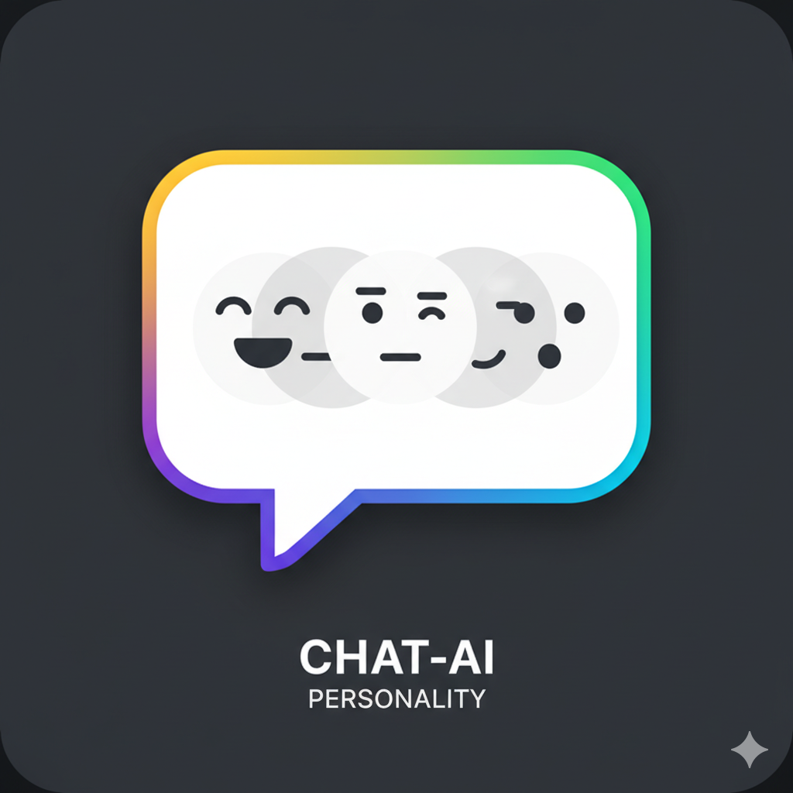

#  chatgpt-personality-selector

ChatGPT Personality Selector is a Google Chrome extension that allows users to customize their chatbot experience. With this extension, users can easily condition their chatbot to become a person or tool specialized in a specific area such as an educator, doctor, translator, password generator, stand-up comedian, psychic, expert in startup creation, developer, prompt generator for art AI, coding helper, Dungeon and Dragons game master, or even a Linux, python or other terminal and many more (more than 176 personalizations in two languages for now).

It can also be used to extend chatgpt and make it talk with external tools like doing websearches and talking to an image question/answering tool. With this, you can pump up your usage of chatgpt as you can show it images and ask it to use that for building websites or whatever you need. You can also ask it to find you a product based of your own specifications. It can produce Art in many forms. 

The extension also includes an interesting feature, a text-based game including Dungeon and Dragons (DnD) which is fun and engaging. Additionally, the extension includes a text-to-speech tool which makes the interaction with the AI very natural.

To use the extension, users simply select the desired personality from the large set of options and press the validation button. The chatbot will then be instantly transformed and ready to perform the specific task with ease.

# Usage

When you install the extension, this UI will show up the next time you open up the chatgpt website. As you can see, some elements are added to the UI. First, you have a new menu that shows the Personality Selector settings dialog. You can also notice the appearance of a microphone near the input text and a speaker in the responses. As you have probably guessed, the microphone is used to input text by just speaking and the speaker reads the responses.

The settings UI is intuitive and simple:

- Select the language
- Select the personality category
- Select the personality
- Press Apply

You can activate autoread so that the text written by chatgpt will be automatically read when it is ready. This is useful for some applications such as playing Dungeons and Dragons. It is always more pleasant to hear instead of reading.

For some personalities, there is a disclaimer that you should read carefully to avoid the potential harm of overconfidence like in doctor or some coding tools.

The potential of this tool is high, but still, many things must be done to ensure it works properly and not be used for misinformation or fake news generation.

# ChatGpt written ad to this extention

Are you tired of using a generic chatbot that doesn't seem to understand your specific needs? Look no further, ChatGPT Personality Selector is the ultimate extension for customizing your chatbot experience on Google Chrome.

With ChatGPT Personality Selector, you can easily condition your chatbot to become a person or tool specialized in a very specific area. Whether you need an educator, a doctor, a translator, a password generator, a stand-up comedian, a psychic, an expert in startup creation, a developer, or even a Linux, python or other terminal, this extension has everything you need.

All you have to do is select the desired personality from our large set of options and press the validation button. Watch as your chatbot is instantly transformed and ready to perform a specific task with ease.

Say goodbye to generic chatbots and hello to a personalized experience with ChatGPT Personality Selector. Download the extension now and experience the magic for yourself.

# How to install?

ChatGPT Personality Selector is now live on google chrome extension martket at this address:

https://chrome.google.com/webstore/detail/chatgpt-personality-selec/jdmpccdlifdkhniemenfmieffkdblahk?hl=fr

The extension is free, there are no ads, no cookies, no tipping. It is just a tool to show the possibilities that can be used with chatgpt. Its is also opensource under MIT licence, so you can vew the code, forck it, change it and do what you want with it.

## Note

You can also install the latest version of the extension directly from github. This allows you to test the latest upgrades. Follow these simple steps:

- Go to https://github.com/ParisNeo/chatgpt-personality-selector
- Click on the "Clone or download" button and select "Download ZIP"
- Extract the files from the downloaded ZIP folder
- Open Google Chrome and go to chrome://extensions/
- Turn on the "Developer mode" switch in the top right corner of the page
- Click on the "Load unpacked" button and select the extracted folder

The ChatGPT Personality Selector extension should now be installed and ready to use on your Google Chrome browser.

# Disclamer

Please be aware that ChatGPT is a sophisticated language model that has been trained on vast amounts of data. However, it is important to note that it is not a human and may provide incorrect or misleading outputs. It should be used with caution and not for making critical decisions such as financial or medical choices, as it may not always be reliable despite its advanced capabilities. The purpose of this tool is to assist and enhance human capabilities, not to replace them. It is highly recommended to always consult with a qualified professional before making any important decisions.

We also want to emphasize that we do not endorse any malicious use of this tool, and we do not take responsibility for any negative outcomes that may occur as a result of using it for bad purposes. This is a tool that is intended to be used for research and development and we do not endorse any misuse of it.
